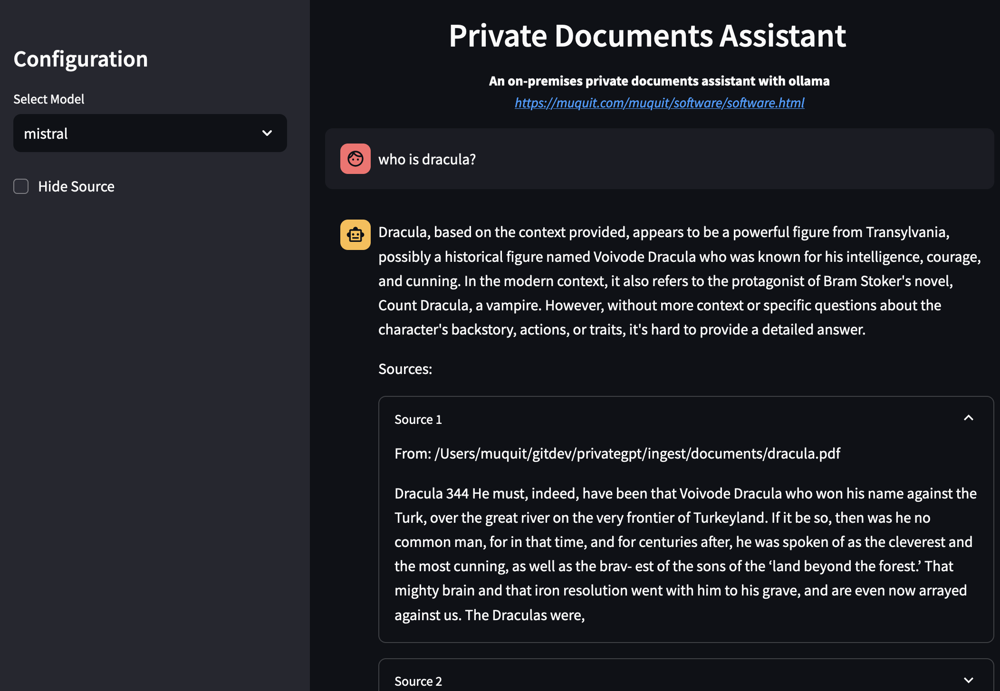
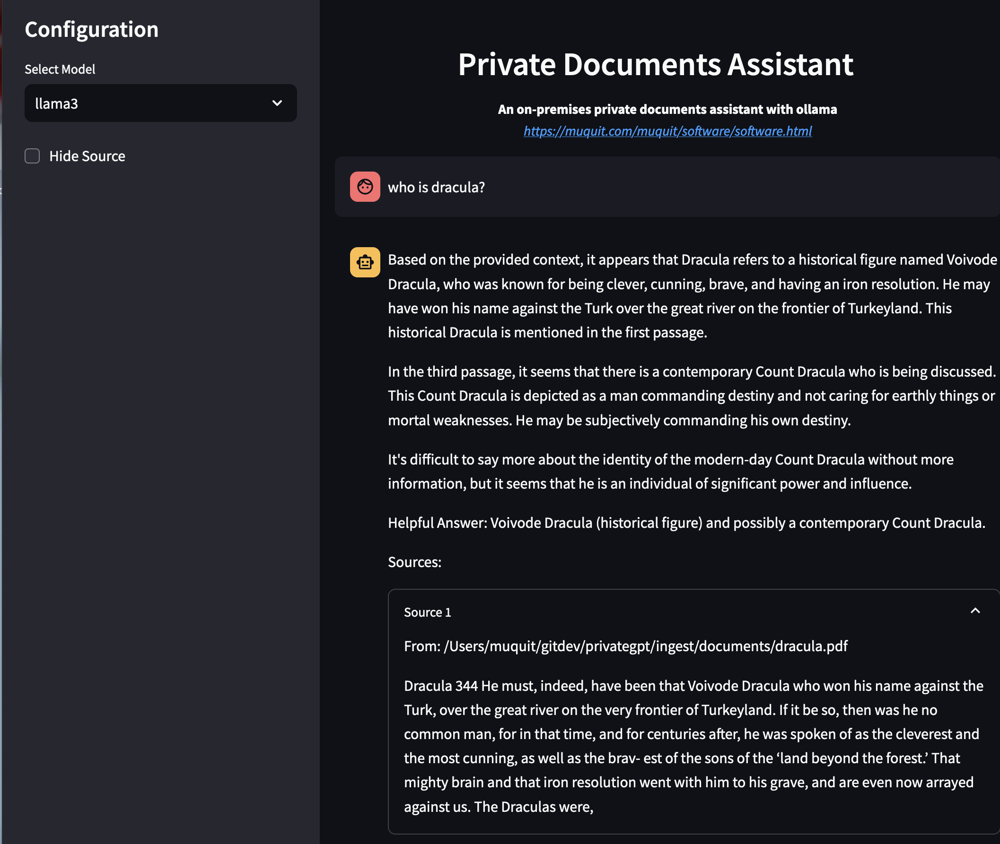
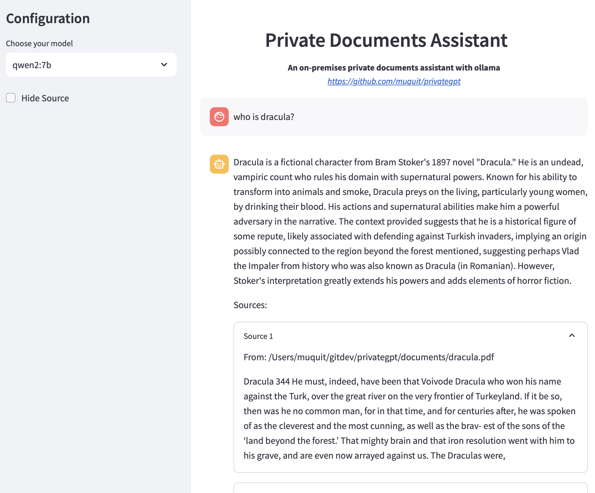
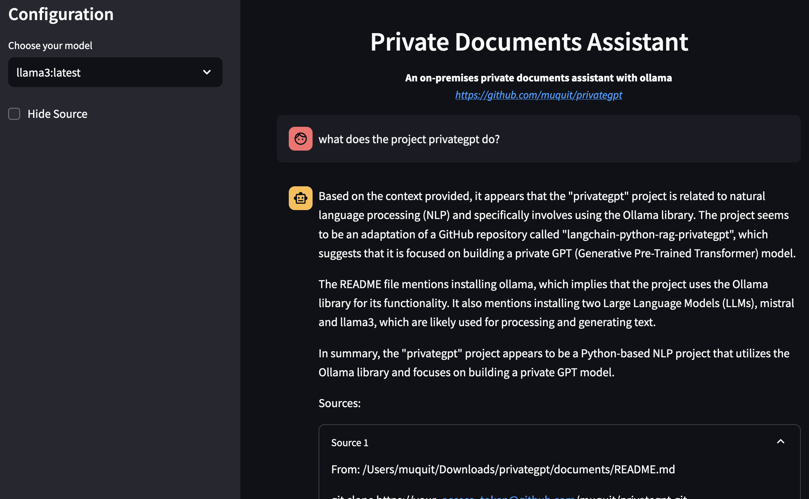

# Introduction

An on-premises ML-powered Retrieval-Augmented Generation (RAG) application. It uses [ollama](https://ollama.com) for running Large Language Models (LLM). [ollama](https://ollama.com) runs on Linux, Mac and Windows on any system with CPU or GPU and performs very well.

This project is based on ollama example code at:
https://github.com/ollama/ollama/tree/main/examples/langchain-python-rag-privategpt

Please look at ChangeLog for details for what is changed.

# How to clone the repo

It's a private repository at this time. Here are the steps to clone it over https. Only collaborators can access the repo.

- Click on the profile at the upper right corner
- Click on **Settings**
- Click on **Developer Settings** all the way at the bottom
- Click on **Personal access tokens**
- Tokens classic
- Generate a classic token
- Copy it, store it, you won’t be able to see it again
- Now clone the repo over https, add the access token after https.
- git clone https://your_access_token@github.com/muquit/privategpt.git
- `cd privategpt`

# Requirements

- [ollama](https://ollama.com)
- python3

# How to use

## Install ollama

- First of all you have to install [ollama](https://ollama.com) on your system.
- Then install 2 Large Language Models (LLMS), I use mistral and llama3. Here is how to install and query models. You can run any model from ollama page. It is also possible to convert any GGUF models from huggingface to ollama modes and use them. I will add instructions on how to do that ...

```
ollama pull mistral
ollama pull llama3
ollama list
ollama run mistral
/bye to exit
```

In my system:

```
$ ollama list
NAME                   	ID          	SIZE  	MODIFIED
qwen2:7b               	dd314f039b9d	4.4 GB	2 days ago
nomic-embed-text:latest	0a109f422b47	274 MB	4 weeks ago
llama3:latest          	365c0bd3c000	4.7 GB	8 weeks ago
mistral:latest         	f974a74358d6	4.1 GB	8 weeks ago
```

The models will be displayed in the select list in the sidebar. To ignore any model, add it in the list in `config.py` with `EXCLUDE_MODELS`

## Install python modules

- Create python virtual environment first. Do not install the modules globally in your system, it can break things.

```
python3 -m venv pvenv
```

If virtual environemnt module is not installed, follow the help message to install it and then create the envionment.

- Activate virtual environment. In Linux, Mac

```
source pvenv/bin/activate
```

- If you need to deactive virtual env

```
deactivate
```

- Install python modules. The following modulles and their dependencies will be installed in the virtual environment.

```
$ cat requirements.txt
tqdm
ollama
langchain_community
langchain_huggingface
langchain-chroma
chromadb
sentence_transformers
pymupdf
streamlit
```

To install the modules:

```
pip3 install -r ./requirements.txt
```

# Configuration file

Update `config.py` if needed:

```
import os
import sys

# If new variables are added, do not forget to
# add it to utils/load_config.py

current_file_path = os.path.abspath(__file__)
VERSION="1.0.2"

# Change if ollama is running on a different system on
# your network or somewhere in the cloud. Please look
# at ollama document and FAQ on how ollama can bind
# to all network interfaces.
# By default use localhost (127.0.0.1)
OLLAMA_URL = "http://127.0.0.1:11434"

PROJECT_ROOT = os.path.dirname(current_file_path)
PROJECT_URL = "https://github.com/muquit/privategpt"
# Set it to False if you do not want to display the project
# URL in web app
SHOW_PROJECT_URL = True
# If you installed various LLMs, a specific model can be picked from
# sidebar
SHOW_SIDEBAR = True

# put your documetns in ./documents directory
DOCUMENT_DIR = os.path.join(PROJECT_ROOT, 'documents')

# database will be created in ./db directory
PERSIST_DIRECTORY = os.path.join(PROJECT_ROOT, 'db')

CHUNK_SIZE = 500
OVERLAP = 50
TARGET_SOURCE_CHUNKS = 4
EMBEDDINGS_MODEL_NAME = "all-MiniLM-L6-v2"

# Log files, Change
LOG_FILE_INGEST = "/tmp/docs_ingest.log"
LOG_FILE_CHAT = "/tmp/private_gpt.log"

# All the loaded will be displayed. To exclude
# any model, add in the list below, for example, there is no
# reason to display an embedding model in the list.
#EXCLUDE_MODELS = []
EXCLUDE_MODELS = ["nomic-embed-text:latest", "qwen2:7b"]
```

# Vectorize your documents

At this time I've noticed good results with PDF _text_ and reqular text documents. The instructions will be updated when I play with other document types.

- The project comes with a free PDF book [dracula.pdf](https://www.planetebook.com/free-ebooks/dracula.pdf) in `./documents` directory. I noticed that the extracted texts from the PDF version of dracula gives much better results than the free dracula.txt and time [Project Guenberg](https://www.gutenberg.org/). If you want, copy some PDF files to `./documents` directory and vectorize them. If new documents are found, they will be appended to the vector database.

```
copy file.pdf ./documents
```

- Vectorize

```
./ingest/ingest.py or ./ingest.sh
```

The vector database will be created in `./db` directory as configured in `config.py`.

# Query your document

Start the web ui

```
./run_assistant_ui.sh
```

It will start a browser in your local machine. `./run_assistant_ui.sh -h` for more info. If you do not want to start a browser, run:

```
$ ./run_assistant_ui.sh no
OK: streamlit is installed
Starting streamlit without opening a browser

  You can now view your Streamlit app in your browser.

  Local URL: http://localhost:8502
  Network URL: http://192.168.1.151:8502
  External URL: http://69.242.124.106:8502
```

Then, point your browser to the URL

# To start over

Remove the content of db folder and ingest documents again. Remove/Add documents in `./documents` directory. If new documents are found, they will be appended to the vector database automatically. The database folder is `./db` as configured in `config.py`

# Screenshot of the web ui

A response for a question about one of the documents. Sources show the chunks found in the similarity search in the database. The chunks are then sent to the locall LLM and the model summerized the chunks as reponse at the top.

from [mistral 7.2B](https://ollama.com/library/mistral) model without GPU:



from [llama3 8b](https://ollama.com/library/llama3) model without GPU:





# Markdown documents

Say you want to ask questions about this project.

```
cp README.md ./documents
```

It will require 2 python modules

```
pip3 install unstructured
pip3 install markdown
./ingest.sh
```



# EPUB documents

I played with some epub documents from https://www.gutenberg.org/ and the results seems to vary based
on the type of documents. This is a work in progress ...

The following are needed to create EMBEDDINGS for EPUB files:

- pandoc binary
- langchain_community unstructured, "unstructured[epub]" and pacdoc python
  modules

In Mac, install pacdoc and related libraries

```
brew install libxml2 libxslt pandoc
```

In linux (ubuntu/debian family):

```
sudo apt-get update
sudo apt-get install -y libxml2-dev libxslt-dev pandoc
```

Install python modules:

```
pip3 install langchain_community unstructured
pip3 install "unstructured[epub]"
pip3 install pandoc
```

Copy documents in ./documents directory at the base of the project

# License

MIT License

Copyright (c) 2024 Muhammad Muquit

Permission is hereby granted, free of charge, to any person obtaining a copy
of this software and associated documentation files (the "Software"), to deal
in the Software without restriction, including without limitation the rights
to use, copy, modify, merge, publish, distribute, sublicense, and/or sell
copies of the Software, and to permit persons to whom the Software is
furnished to do so, subject to the following conditions:

The above copyright notice and this permission notice shall be included in all
copies or substantial portions of the Software.

THE SOFTWARE IS PROVIDED "AS IS", WITHOUT WARRANTY OF ANY KIND, EXPRESS OR
IMPLIED, INCLUDING BUT NOT LIMITED TO THE WARRANTIES OF MERCHANTABILITY,
FITNESS FOR A PARTICULAR PURPOSE AND NONINFRINGEMENT. IN NO EVENT SHALL THE
AUTHORS OR COPYRIGHT HOLDERS BE LIABLE FOR ANY CLAIM, DAMAGES OR OTHER
LIABILITY, WHETHER IN AN ACTION OF CONTRACT, TORT OR OTHERWISE, ARISING FROM,
OUT OF OR IN CONNECTION WITH THE SOFTWARE OR THE USE OR OTHER DEALINGS IN THE
SOFTWARE.

---

This project is adapted from https://github.com/ollama/ollama/tree/main/examples/langchain-python-rag-privategpt
