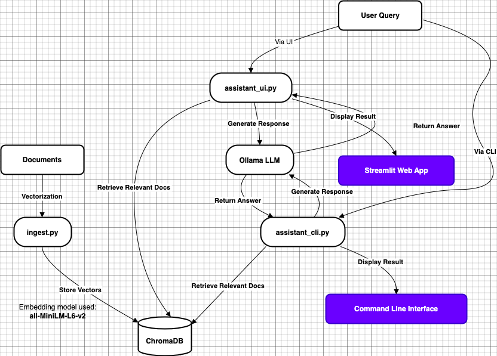

## Page Contents
- [Introduction](#introduction)
- [Background and Motivation](#background-and-motivation)
- [How it works](#how-it-works)
- [Contributing](#contributing)
- [Version](#version)
- [Requirements](#requirements)
- [Installation](#installation)
  - [Clone the  repo](#clone-the--repo)
  - [Install ollama](#install-ollama)
  - [Install python modules](#install-python-modules)
    - [Linux/MacOS](#linuxmacos)
    - [Windows](#windows)
- [Configuration file](#configuration-file)
- [Vectorize your documents](#vectorize-your-documents)
- [Query your document](#query-your-document)
  - [Web UI](#web-ui)
  - [CLI](#cli)
- [Screenshot of the web ui](#screenshot-of-the-web-ui)
- [Run web ui as a service](#run-web-ui-as-a-service)
  - [Linux Systemd](#linux-systemd)
  - [Linux sysv](#linux-sysv)
  - [MacOS](#macos)
  - [Windows ](#windows-)
- [List documents](#list-documents)
- [Known Issues](#known-issues)
- [Roadmap/TODO](#roadmaptodo)
- [License](#license)


**privategpt** is an OpenSource Machine Learning (ML) based application to
query your local documents in natural language using local large Language
Models (LLM). It has a web ui and a cli for querying documents.

# Introduction

It uses [ollama](https://ollama.com) for running Large Language Models (LLM).
[ollama](https://ollama.com) runs on Linux, Mac and Windows on any system 
with CPU or GPU and performs very well.

The lincense is [MIT](#license).

# Background and Motivation

This project emerged from a personal exploration into 
[RAG](https://blogs.nvidia.com/blog/what-is-retrieval-augmented-generation/)
applications using local Large Language Models (LLMs). 
RAG is a fancy acronym for findng similar document fracments (chunks) 
using machine learing algorithm in your local documents and send the chunks to a 
Large Language Model (LLM) to make sense out them by summarizing the chunks.

Inspired by the potential of RAG technology, but lacking time and resource 
for training or fine-tuning an LLM, the project began as an experiment with local 
LLMs. The most important goal was not to send propietary documents to
cloud for searching.

The project was initially based on the 
[privateGPT](https://github.com/ollama/ollama/tree/main/examples/langchain-python-rag-privategpt)
example from the ollama gitHub repo, which demonstrated impressive results 
with local document querying. But the original example became outdated 
and at one point it stopped working, this project aimed to revive and 
improve upon the concept.

Efforts were made to ensure the application works across Linux, Mac, and 
Windows platforms, with improved documentation on RAG functionality.
The codebase was modularized, configurations were added, and the overall 
structure was refined to make it potentially production-ready. 

I plan to keep the project simple and easy to understand. Hope you will find
the project useful as well.

Please look at [ChangeLog](ChangeLog.md).for details for what is changed.
Please look at the [Roadmap/TODO](#roadmaptodo) section for future plans.

# How it works



This diagram is created by Claude AI in mermaid format from my description then I used draw.io on desktop to tweak it little bit.


# Contributing

Please send a pull request if you add features, fix bugs or update the documentation. 

If you want to update the documentation, **please do not update README.md directly**, 
rather update the Markdown files in _markdowns/_ directory. README.md 
is generated by [markdown_helper](https://github.com/BurdetteLamar/markdown_helper) ruby gem by
assembling the individual Markdown files in the _markdowns/_ directory. If you
would like to generate README.md, run `scripts/combine_markdowns.sh` (you will need the required tools of
course)

# Version

The current version of the tools is 1.0.2

Please look at [ChangeLog](ChangeLog.md) for what has changed in the current version.

# Requirements

- [ollama](https://ollama.com)
- python3


# Installation

## Clone the  repo

    git clone https://github.com/muquit/privategpt.git
    cd privategpt

## Install ollama

- First of all you have to install [ollama](https://ollama.com) on your system.
- To check if ollama is running, point your browser to `http://127.0.0.1:11434`. You should see:

```
Ollama is running
```

- Then install 2 Large Language Models (LLMS), I use mistral and llama3. 
Here is how to install and query models. You can run any model from ollama 
page. It is also possible to convert any GGUF models from huggingface to 
ollama modes and use them. I will add instructions on how to do that ...

```
ollama pull mistral
ollama pull llama3
ollama list
ollama run mistral
/bye to exit
```

In my system:

```
$ ollama list
NAME                    ID              SIZE    MODIFIED
qwen2:7b                dd314f039b9d    4.4 GB  2 days ago
nomic-embed-text:latest 0a109f422b47    274 MB  4 weeks ago
llama3:latest           365c0bd3c000    4.7 GB  8 weeks ago
mistral:latest          f974a74358d6    4.1 GB  8 weeks ago
```

The models will be displayed in the select list in the sidebar. To ignore 
any model, add it in the list in `config.py` with `EXCLUDE_MODELS`

## Install python modules

- Create python virtual environment first. **Do not install the modules globally in your system, it can break things.**

### Linux/MacOS
```
python3 -m venv pvenv
```

If virtual environemnt module is not installed, follow the help message to install it and then create the envionment. In Ubuntu, you might see the message to install `apt install python3.12-venv`. So, do that first and then go back to the previous step to create the python3 virtual environment.

- Activate virtual environment

```
source pvenv/bin/activate
```

- If you need to deactive virtual env

```
deactivate
```

### Windows
```
python3 -m venv pvenv
```

- Activate virtual environment

```
pvenv\Scripts\activate
```

- If you need to deactive virtual env

```
pvenv\Scripts\deactivate
```

- Install python modules. The following modulles and their dependencies will be installed in the virtual environment.

```
$ more requirements.txt
tqdm
ollama
langchain_community
langchain_huggingface
langchain-chroma
chromadb
sentence_transformers
pymupdf
streamlit
```

To install the modules:

```
pip3 install -r requirements.txt
```

# Configuration file

    import os
    import sys
    
    # If new variables are added, do not forget to
    # add it to utils/load_config.py
    
    current_file_path = os.path.abspath(__file__)
    PROJECT_ROOT = os.path.dirname(current_file_path)
    VERSION="1.0.2"
    
    APP_TITLE = "Private Documents Assistant"
    APP_DESCRIPTION = "An on-premises private documents assistant with ollama"
    PROJECT_URL = "https://github.com/muquit/privategpt"
    SHOW_PROJECT_URL = True
    SHOW_SIDEBAR = True
    ASK_ME_TEXT = "Ask me anything about your documents"
    
    # Change if ollama is running on a different system on 
    # your network or somewhere in the cloud. Please look
    # at ollama document and FAQ on how ollama can bind
    # to all network interfaces.
    # By default use localhost (127.0.0.1)
    OLLAMA_URL = "http://127.0.0.1:11434"
    
    
    # put your documents in ./documents directory
    DOCUMENT_DIR = os.path.join(PROJECT_ROOT, 'documents')
    
    # database will be created in ./db directory
    PERSIST_DIRECTORY = os.path.join(PROJECT_ROOT, 'db')
    
    CHUNK_SIZE = 500
    OVERLAP = 50
    TARGET_SOURCE_CHUNKS = 4
    EMBEDDINGS_MODEL_NAME = "all-MiniLM-L6-v2"
    
    # Log files, Change
    LOG_FILE_INGEST = os.path.join(PROJECT_ROOT, 'docs_ingest.log')
    LOG_FILE_CHAT = os.path.join(PROJECT_ROOT, 'private_gpt.log')
    
    # default LLM  for console app. web app list the loaded models
    # dynamically
    DEFAULT_MODEL = "mistral"
    
    # All the loaded models will be displayed on the sidebar. To exclude
    # any model, add in the list below, for example, there is no
    # reason to display an embedding model in the list for example.
    #EXCLUDE_MODELS = []
    EXCLUDE_MODELS = ["nomic-embed-text:latest", "qwen2:7b"]
    

# Vectorize your documents

This project uses [chroma db](https://docs.trychroma.com/) for storing
document embeddings/vectors.

At this time I've noticed good results with PDF _text_ and reqular text documents. The instructions will be updated when I play with other document types.

- The project comes with a free PDF book [dracula.pdf](https://www.planetebook.com/free-ebooks/dracula.pdf) in `./documents` directory. I noticed that the extracted texts from the PDF version of dracula gives much better results than the free dracula.txt and time [Project Gutenberg](https://www.gutenberg.org/). If you want, copy some PDF files to `./documents` directory and vectorize them. If new documents are found, they will be appended to the vector database.

```
copy file.pdf ./documents
```

- Vectorize

```
python3 ./ingest/ingest.py or ./ingest.sh
```

The vector database will be created in `./db` directory as configured in `config.py`.

# Query your document

The document can be queried from a web ui or from command line


## Web UI

Start the web ui

```
streamlit run ./assistant/assistant_ui.py
or
./run_assistant_ui.sh
```

It will start a browser in your local machine. `./run_assistant_ui.sh -h` for more info. If you do not want to   start a browser, run:

```
streamlit run ./assistant/assistant_ui.py --server.headless true
or
$ ./run_assistant_ui.sh no
OK: streamlit is installed
Starting streamlit without opening a browser

  You can now view your Streamlit app in your browser.

  Local URL: http://localhost:8502
  Network URL: http://192.168.1.151:8502
  External URL: http://xxx.xxx.xxx.xxx:8502
```

## CLI

```
usage: assistant_cli.py [-h] [--hide-source] [--mute-stream] [--model MODEL]

privategpt: Ask questions to your documents without an internet connection,
using the power of LLMs.

options:
  -h, --help            show this help message and exit
  --hide-source, -S     Use this flag to disable printing of source documents
                        used for answers.
  --mute-stream, -M     Use this flag to disable the streaming StdOut callback
                        for LLMs.
  --model MODEL, -m MODEL
                        Specify the model to use. Defaults to the value set in
                        config.py.
```

# Screenshot of the web ui

A response for a question about one of the documents. Sources show the chunks found in the similarity search in the database. The chunks are then sent to the locall LLM and the model summerized the chunks as reponse at the top.

from [mistral 7.2B](https://ollama.com/library/mistral) model without GPU:


from [llama3 8b](https://ollama.com/library/llama3) model without GPU:


# Run web ui as a service
## Linux Systemd

Please look at `systemd/` directory. It needs some cleaning up but it works

## Linux sysv

TODO

## MacOS

TODO

## Windows 

TODO

# List documents

To list documents in chromadb, use the following scripts

```
scripts/list_chroma_metadata.py
scripts/list_chroma_metadata_files.py
scripts/list_chroma_metadata_json.py
scripts/list_chroma_metadata_pretty.py
```

# Known Issues

Currently all the documents in the chromadb are searched for simillarity, 
which can return wrong information if documents contain similar texts. 
Please look at the returned **Source** to make sure the response is correct.

[Roadmap/TODO](#roadmaptodo) is to allow to select documents to 
search for similarity and use chromadb's filtering mechanism to perform the 
similarity search before sending the chunks to LLM.


# Roadmap/TODO
* Currently all the documents in the chromadb are searched which can return wrong
information if documents contain similar texts. Allow to select
one or more documents to search and use chromadb's filtering mechanism to perform the
similarity search before sending the chunks to LLM.

* Support other OpenSource vector database like [qdrant](https://github.com/qdrant/qdrant)

* Add readline like history to CLI

* Create a docker image

* Run the web ui as a service for Linux, MacOS and Windows. systemd unit file
and script are in systemd directory, needs some modifying for your needs, like
change user and group.
* 
* etc...

# License

    MIT License
    
    Copyright (c) 2024 Muhammad Muquit
    
    Permission is hereby granted, free of charge, to any person obtaining a copy
    of this software and associated documentation files (the "Software"), to deal
    in the Software without restriction, including without limitation the rights
    to use, copy, modify, merge, publish, distribute, sublicense, and/or sell
    copies of the Software, and to permit persons to whom the Software is
    furnished to do so, subject to the following conditions:
    
    The above copyright notice and this permission notice shall be included in all
    copies or substantial portions of the Software.
    
    THE SOFTWARE IS PROVIDED "AS IS", WITHOUT WARRANTY OF ANY KIND, EXPRESS OR
    IMPLIED, INCLUDING BUT NOT LIMITED TO THE WARRANTIES OF MERCHANTABILITY,
    FITNESS FOR A PARTICULAR PURPOSE AND NONINFRINGEMENT. IN NO EVENT SHALL THE
    AUTHORS OR COPYRIGHT HOLDERS BE LIABLE FOR ANY CLAIM, DAMAGES OR OTHER
    LIABILITY, WHETHER IN AN ACTION OF CONTRACT, TORT OR OTHERWISE, ARISING FROM,
    OUT OF OR IN CONNECTION WITH THE SOFTWARE OR THE USE OR OTHER DEALINGS IN THE
    SOFTWARE.
    
    ---
    
    This project is adapted from:
    https://github.com/ollama/ollama/tree/main/examples/langchain-python-rag-privategpt

---
* This file is assembled from markdowns/*.md with [markdown_helper](https://github.com/BurdetteLamar/markdown_helper)
